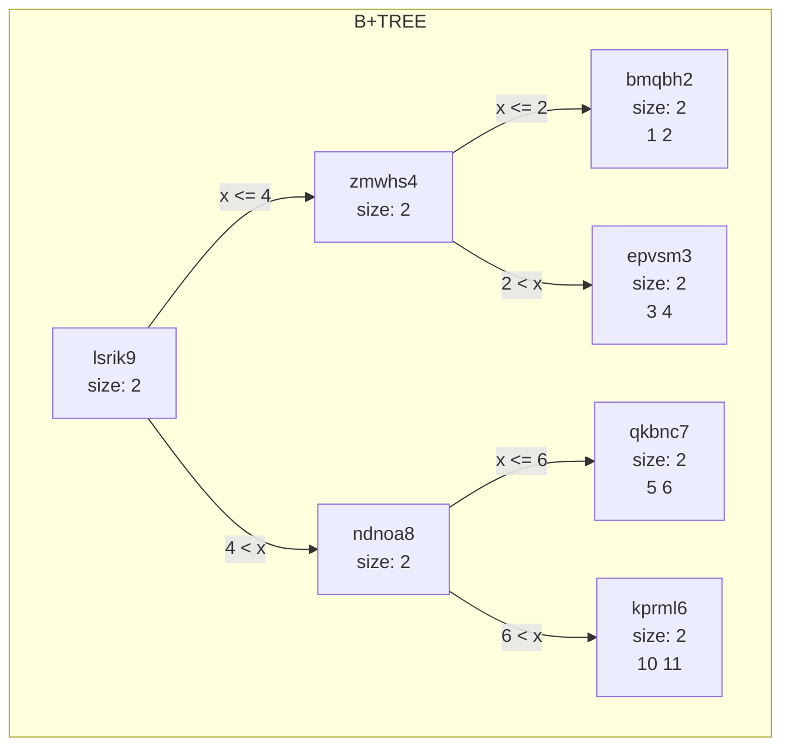
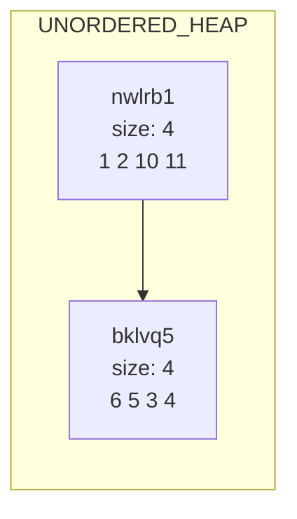

```mermaid
graph TD
subgraph B+TREE
lsrik9[lsrik9<br/>size: 2<br/>]
zmwhs4[zmwhs4<br/>size: 2<br/>]
bmqbh2[bmqbh2<br/>size: 2<br/>1 2 ]
zmwhs4-->|x <= 2|bmqbh2
epvsm3[epvsm3<br/>size: 2<br/>3 4 ]
zmwhs4-->|2 < x|epvsm3
lsrik9-->|x <= 4|zmwhs4
ndnoa8[ndnoa8<br/>size: 2<br/>]
qkbnc7[qkbnc7<br/>size: 2<br/>5 6 ]
ndnoa8-->|x <= 6|qkbnc7
kprml6[kprml6<br/>size: 2<br/>10 11 ]
ndnoa8-->|6 < x|kprml6
lsrik9-->|4 < x|ndnoa8
end
```

```mermaid
graph LR
subgraph UNORDERED_HEAP
nwlrb1[nwlrb1<br/>size: 4<br/>1 2 10 11 ]
bklvq5[bklvq5<br/>size: 4<br/>6 5 3 4 ]
nwlrb1-->bklvq5
end
```
