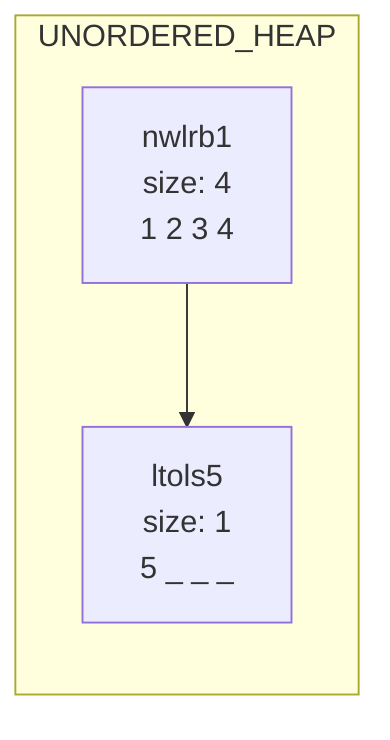

```mermaid
graph TD
subgraph B+TREE
jtwrp4[jtwrp4<br/>size: 2<br/>]
bmqbh2[bmqbh2<br/>size: 2<br/>1 2 ]
jtwrp4-->|x <= 2|bmqbh2
jzpvx3[jzpvx3<br/>size: 2<br/>3 4 ]
jtwrp4-->|2 < x|jzpvx3
end
```

```mermaid
graph LR
subgraph UNORDERED_HEAP
nwlrb1[nwlrb1<br/>size: 4<br/>1 2 3 4 ]
ltols5[ltols5<br/>size: 1<br/>5 _ _ _ ]
nwlrb1-->ltols5
end
```
