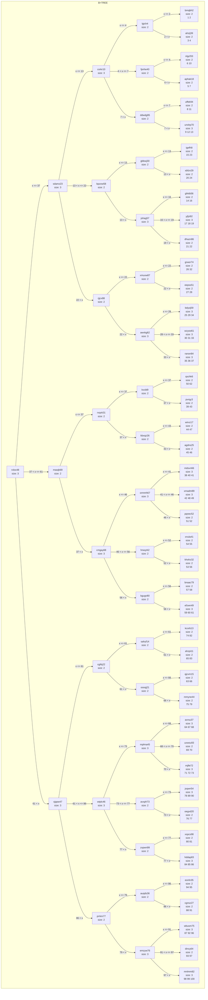
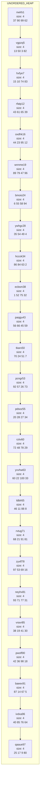

```mermaid
graph TD
subgraph B+TREE
rxlox48[rxlox48<br/>size: 3<br/>]
sdamz23[sdamz23<br/>size: 3<br/>]
corkr10[corkr10<br/>size: 3<br/>]
lgich4[lgich4<br/>size: 2<br/>]
bmqbh2[bmqbh2<br/>size: 2<br/>1 2 ]
lgich4-->|x <= 2|bmqbh2
ahzij39[ahzij39<br/>size: 2<br/>3 4 ]
lgich4-->|2 < x|ahzij39
corkr10-->|x <= 4|lgich4
fpnhe40[fpnhe40<br/>size: 2<br/>]
nlgcf33[nlgcf33<br/>size: 2<br/>6 10 ]
fpnhe40-->|x <= 4|nlgcf33
aphak18[aphak18<br/>size: 2<br/>5 7 ]
fpnhe40-->|4 < x|aphak18
corkr10-->|4 < x <= 7|fpnhe40
ddwdg95[ddwdg95<br/>size: 2<br/>]
uffek94[uffek94<br/>size: 2<br/>8 11 ]
ddwdg95-->|x <= 7|uffek94
unshp70[unshp70<br/>size: 3<br/>9 12 13 ]
ddwdg95-->|7 < x|unshp70
corkr10-->|7 < x|ddwdg95
sdamz23-->|x <= 13|corkr10
bpzow58[bpzow58<br/>size: 2<br/>]
gbbwj30[gbbwj30<br/>size: 2<br/>]
igefh8[igefh8<br/>size: 2<br/>15 23 ]
gbbwj30-->|x <= 13|igefh8
xbfzn29[xbfzn29<br/>size: 2<br/>20 24 ]
gbbwj30-->|13 < x|xbfzn29
bpzow58-->|x <= 13|gbbwj30
johag57[johag57<br/>size: 3<br/>]
ghkib56[ghkib56<br/>size: 2<br/>14 16 ]
johag57-->|x <= 16|ghkib56
yjfyi92[yjfyi92<br/>size: 3<br/>17 18 19 ]
johag57-->|16 < x <= 19|yjfyi92
dhazn86[dhazn86<br/>size: 2<br/>21 22 ]
johag57-->|19 < x|dhazn86
bpzow58-->|13 < x|johag57
sdamz23-->|13 < x <= 22|bpzow58
rjjcx88[rjjcx88<br/>size: 2<br/>]
xmuxw87[xmuxw87<br/>size: 2<br/>]
grwor74[grwor74<br/>size: 2<br/>26 32 ]
xmuxw87-->|x <= 22|grwor74
eepss51[eepss51<br/>size: 2<br/>27 28 ]
xmuxw87-->|22 < x|eepss51
rjjcx88-->|x <= 22|xmuxw87
awxkg62[awxkg62<br/>size: 3<br/>]
bdyoj59[bdyoj59<br/>size: 3<br/>25 29 34 ]
awxkg62-->|x <= 28|bdyoj59
wzyoo61[wzyoo61<br/>size: 3<br/>30 31 33 ]
awxkg62-->|28 < x <= 33|wzyoo61
ranon84[ranon84<br/>size: 3<br/>35 36 37 ]
awxkg62-->|33 < x|ranon84
rjjcx88-->|22 < x|awxkg62
sdamz23-->|22 < x|rjjcx88
rxlox48-->|x <= 37|sdamz23
mawjk69[mawjk69<br/>size: 2<br/>]
rxqvk31[rxqvk31<br/>size: 2<br/>]
kvcbl9[kvcbl9<br/>size: 2<br/>]
qschk6[qschk6<br/>size: 2<br/>50 62 ]
kvcbl9-->|x <= 37|qschk6
pvrqy3[pvrqy3<br/>size: 2<br/>39 43 ]
kvcbl9-->|37 < x|pvrqy3
rxqvk31-->|x <= 37|kvcbl9
kbxqz26[kbxqz26<br/>size: 2<br/>]
wirvz17[wirvz17<br/>size: 2<br/>44 47 ]
kbxqz26-->|x <= 43|wirvz17
agdns25[agdns25<br/>size: 2<br/>45 46 ]
kbxqz26-->|43 < x|agdns25
rxqvk31-->|37 < x|kbxqz26
mawjk69-->|x <= 37|rxqvk31
cmgay68[cmgay68<br/>size: 3<br/>]
ormmh67[ormmh67<br/>size: 3<br/>]
mdsvn66[mdsvn66<br/>size: 3<br/>38 40 41 ]
ormmh67-->|x <= 41|mdsvn66
xmadm89[xmadm89<br/>size: 3<br/>42 48 49 ]
ormmh67-->|41 < x <= 46|xmadm89
pqnec52[pqnec52<br/>size: 2<br/>51 52 ]
ormmh67-->|46 < x|pqnec52
cmgay68-->|x <= 46|ormmh67
hnwyt42[hnwyt42<br/>size: 2<br/>]
xnula41[xnula41<br/>size: 2<br/>54 55 ]
hnwyt42-->|x <= 52|xnula41
khohz32[khohz32<br/>size: 2<br/>53 56 ]
hnwyt42-->|52 < x|khohz32
cmgay68-->|46 < x <= 56|hnwyt42
kgugv80[kgugv80<br/>size: 2<br/>]
bnaac79[bnaac79<br/>size: 2<br/>57 58 ]
kgugv80-->|x <= 56|bnaac79
efzwn49[efzwn49<br/>size: 3<br/>59 60 61 ]
kgugv80-->|56 < x|efzwn49
cmgay68-->|56 < x|kgugv80
mawjk69-->|37 < x|cmgay68
rxlox48-->|37 < x <= 61|mawjk69
vjppw47[vjppw47<br/>size: 3<br/>]
cgifq22[cgifq22<br/>size: 2<br/>]
sahyf14[sahyf14<br/>size: 2<br/>]
kcorb13[kcorb13<br/>size: 2<br/>74 82 ]
sahyf14-->|x <= 61|kcorb13
ahzpi11[ahzpi11<br/>size: 2<br/>65 83 ]
sahyf14-->|61 < x|ahzpi11
cgifq22-->|x <= 61|sahyf14
oooqj21[oooqj21<br/>size: 2<br/>]
qjcvm15[qjcvm15<br/>size: 2<br/>63 66 ]
oooqj21-->|x <= 66|qjcvm15
mmyne44[mmyne44<br/>size: 2<br/>75 79 ]
oooqj21-->|66 < x|mmyne44
cgifq22-->|61 < x|oooqj21
vjppw47-->|x <= 61|cgifq22
wtplc46[wtplc46<br/>size: 3<br/>]
mplma45[mplma45<br/>size: 3<br/>]
axrsu37[axrsu37<br/>size: 3<br/>64 67 68 ]
mplma45-->|x <= 68|axrsu37
uxwou93[uxwou93<br/>size: 2<br/>69 70 ]
mplma45-->|68 < x <= 70|uxwou93
mjlfe72[mjlfe72<br/>size: 3<br/>71 72 73 ]
mplma45-->|70 < x|mjlfe72
wtplc46-->|x <= 73|mplma45
avxph73[avxph73<br/>size: 2<br/>]
jxqwn54[jxqwn54<br/>size: 3<br/>78 89 90 ]
avxph73-->|x <= 73|jxqwn54
oegxd20[oegxd20<br/>size: 2<br/>76 77 ]
avxph73-->|73 < x|oegxd20
wtplc46-->|73 < x <= 77|avxph73
zxpwn99[zxpwn99<br/>size: 2<br/>]
xspcs98[xspcs98<br/>size: 2<br/>80 81 ]
zxpwn99-->|x <= 77|xspcs98
hddap83[hddap83<br/>size: 3<br/>84 85 86 ]
zxpwn99-->|77 < x|hddap83
wtplc46-->|77 < x|zxpwn99
vjppw47-->|61 < x <= 86|wtplc46
prrkm77[prrkm77<br/>size: 2<br/>]
auqds36[auqds36<br/>size: 2<br/>]
eonln35[eonln35<br/>size: 2<br/>94 95 ]
auqds36-->|x <= 86|eonln35
cgnsz27[cgnsz27<br/>size: 2<br/>88 91 ]
auqds36-->|86 < x|cgnsz27
prrkm77-->|x <= 79|auqds36
emzyw76[emzyw76<br/>size: 3<br/>]
wbusm75[wbusm75<br/>size: 3<br/>87 92 96 ]
emzyw76-->|x <= 91|wbusm75
dincy64[dincy64<br/>size: 2<br/>93 97 ]
emzyw76-->|91 < x <= 97|dincy64
mnlmm82[mnlmm82<br/>size: 3<br/>98 99 100 ]
emzyw76-->|97 < x|mnlmm82
prrkm77-->|79 < x|emzyw76
vjppw47-->|86 < x|prrkm77
rxlox48-->|61 < x|vjppw47
end
```

```mermaid
graph LR
subgraph UNORDERED_HEAP
nwlrb1[nwlrb1<br/>size: 4<br/>37 90 99 62 ]
vgpzq5[vgpzq5<br/>size: 4<br/>13 50 3 82 ]
nwlrb1-->vgpzq5
hxfye7[hxfye7<br/>size: 4<br/>15 10 74 83 ]
vgpzq5-->hxfye7
rfatp12[rfatp12<br/>size: 4<br/>43 61 65 39 ]
hxfye7-->rfatp12
oxdhk16[oxdhk16<br/>size: 4<br/>44 23 95 12 ]
rfatp12-->oxdhk16
wnnme19[wnnme19<br/>size: 4<br/>89 79 47 96 ]
oxdhk16-->wnnme19
bmoio24[bmoio24<br/>size: 4<br/>6 55 58 94 ]
wnnme19-->bmoio24
ywhgc28[ywhgc28<br/>size: 4<br/>35 54 49 4 ]
bmoio24-->ywhgc28
hccok34[hccok34<br/>size: 4<br/>86 84 63 2 ]
ywhgc28-->hccok34
ecbsm38[ecbsm38<br/>size: 4<br/>1 52 75 32 ]
hccok34-->ecbsm38
paqgu43[paqgu43<br/>size: 4<br/>56 66 45 59 ]
ecbsm38-->paqgu43
tkarx50[tkarx50<br/>size: 4<br/>70 24 51 7 ]
paqgu43-->tkarx50
pcngr53[pcngr53<br/>size: 4<br/>92 57 26 73 ]
tkarx50-->pcngr53
pdsoz55[pdsoz55<br/>size: 4<br/>20 28 27 34 ]
pcngr53-->pdsoz55
rziiv60[rziiv60<br/>size: 4<br/>72 48 78 29 ]
pdsoz55-->rziiv60
yvvhw63[yvvhw63<br/>size: 4<br/>60 22 100 33 ]
rziiv60-->yvvhw63
ldblr65[ldblr65<br/>size: 4<br/>46 11 88 8 ]
yvvhw63-->ldblr65
rvtug71[rvtug71<br/>size: 4<br/>68 21 91 81 ]
ldblr65-->rvtug71
zyxlf78[zyxlf78<br/>size: 4<br/>97 53 69 16 ]
rvtug71-->zyxlf78
neyhx81[neyhx81<br/>size: 4<br/>93 71 77 31 ]
zyxlf78-->neyhx81
vravr85[vravr85<br/>size: 4<br/>38 19 41 30 ]
neyhx81-->vravr85
pwofl90[pwofl90<br/>size: 4<br/>42 36 98 18 ]
vravr85-->pwofl90
baeex91[baeex91<br/>size: 4<br/>87 14 67 5 ]
pwofl90-->baeex91
ivdxa96[ivdxa96<br/>size: 4<br/>40 85 76 64 ]
baeex91-->ivdxa96
qaaue97[qaaue97<br/>size: 4<br/>25 17 9 80 ]
ivdxa96-->qaaue97
end
```
