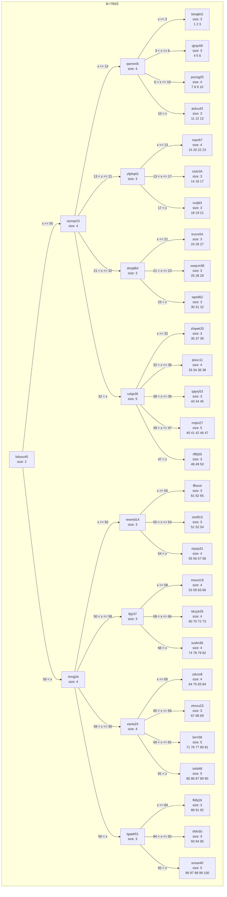
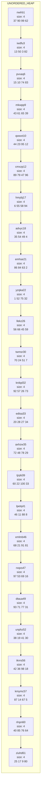

```mermaid
graph TD
subgraph B+TREE
bdusu45[bdusu45<br/>size: 2<br/>]
wynsp15[wynsp15<br/>size: 4<br/>]
qwmmi5[qwmmi5<br/>size: 4<br/>]
bmqbh2[bmqbh2<br/>size: 3<br/>1 2 3 ]
qwmmi5-->|x <= 3|bmqbh2
qjrqu59[qjrqu59<br/>size: 3<br/>4 5 6 ]
qwmmi5-->|3 < x <= 6|qjrqu59
puzog20[puzog20<br/>size: 4<br/>7 8 9 10 ]
qwmmi5-->|6 < x <= 10|puzog20
aoluu42[aoluu42<br/>size: 3<br/>11 12 13 ]
qwmmi5-->|10 < x|aoluu42
wynsp15-->|x <= 13|qwmmi5
zfphq43[zfphq43<br/>size: 3<br/>]
sxpzb7[sxpzb7<br/>size: 4<br/>15 20 22 23 ]
zfphq43-->|x <= 13|sxpzb7
clulv34[clulv34<br/>size: 3<br/>14 16 17 ]
zfphq43-->|13 < x <= 17|clulv34
ivvij63[ivvij63<br/>size: 3<br/>18 19 21 ]
zfphq43-->|17 < x|ivvij63
wynsp15-->|13 < x <= 21|zfphq43
zkrqd64[zkrqd64<br/>size: 3<br/>]
trxcm54[trxcm54<br/>size: 3<br/>24 26 27 ]
zkrqd64-->|x <= 21|trxcm54
xwqcm38[xwqcm38<br/>size: 3<br/>25 28 29 ]
zkrqd64-->|21 < x <= 23|xwqcm38
wpoli62[wpoli62<br/>size: 3<br/>30 31 32 ]
zkrqd64-->|23 < x|wpoli62
wynsp15-->|21 < x <= 32|zkrqd64
ruhje28[ruhje28<br/>size: 5<br/>]
zhqwk25[zhqwk25<br/>size: 3<br/>35 37 39 ]
ruhje28-->|x <= 32|zhqwk25
ipsxc11[ipsxc11<br/>size: 4<br/>33 34 36 38 ]
ruhje28-->|32 < x <= 38|ipsxc11
qayiy53[qayiy53<br/>size: 3<br/>43 44 45 ]
ruhje28-->|38 < x <= 39|qayiy53
mqlvi27[mqlvi27<br/>size: 5<br/>40 41 42 46 47 ]
ruhje28-->|39 < x <= 47|mqlvi27
rfftb55[rfftb55<br/>size: 3<br/>48 49 50 ]
ruhje28-->|47 < x|rfftb55
wynsp15-->|32 < x|ruhje28
bdusu45-->|x <= 50|wynsp15
rhmjj44[rhmjj44<br/>size: 4<br/>]
rewmd14[rewmd14<br/>size: 3<br/>]
fffxm4[fffxm4<br/>size: 3<br/>61 62 65 ]
rewmd14-->|x <= 50|fffxm4
osoft13[osoft13<br/>size: 3<br/>51 52 54 ]
rewmd14-->|50 < x <= 54|osoft13
otyep31[otyep31<br/>size: 4<br/>55 56 57 58 ]
rewmd14-->|54 < x|otyep31
rhmjj44-->|x <= 50|rewmd14
ltijz37[ltijz37<br/>size: 3<br/>]
mouct19[mouct19<br/>size: 4<br/>53 59 63 66 ]
ltijz37-->|x <= 58|mouct19
kkzyk29[kkzyk29<br/>size: 4<br/>60 70 72 73 ]
ltijz37-->|58 < x <= 66|kkzyk29
tusfm36[tusfm36<br/>size: 4<br/>74 78 79 82 ]
ltijz37-->|66 < x|tusfm36
rhmjj44-->|50 < x <= 58|ltijz37
vaxta24[vaxta24<br/>size: 4<br/>]
zdvzx8[zdvzx8<br/>size: 4<br/>64 75 83 84 ]
vaxta24-->|x <= 65|zdvzx8
ztmzu23[ztmzu23<br/>size: 3<br/>67 68 69 ]
vaxta24-->|65 < x <= 69|ztmzu23
birrr58[birrr58<br/>size: 5<br/>71 76 77 80 81 ]
vaxta24-->|69 < x <= 81|birrr58
ixhtt48[ixhtt48<br/>size: 5<br/>85 86 87 89 90 ]
vaxta24-->|81 < x|ixhtt48
rhmjj44-->|58 < x <= 90|vaxta24
tgapb51[tgapb51<br/>size: 3<br/>]
fklbj16[fklbj16<br/>size: 3<br/>88 91 92 ]
tgapb51-->|x <= 84|fklbj16
rlhfv50[rlhfv50<br/>size: 3<br/>93 94 95 ]
tgapb51-->|84 < x <= 92|rlhfv50
srooe40[srooe40<br/>size: 5<br/>96 97 98 99 100 ]
tgapb51-->|92 < x|srooe40
rhmjj44-->|90 < x|tgapb51
bdusu45-->|50 < x|rhmjj44
end
```

```mermaid
graph LR
subgraph UNORDERED_HEAP
nwlrb1[nwlrb1<br/>size: 4<br/>37 90 99 62 ]
iwdfu3[iwdfu3<br/>size: 4<br/>13 50 3 82 ]
nwlrb1-->iwdfu3
pvxaq6[pvxaq6<br/>size: 4<br/>15 10 74 83 ]
iwdfu3-->pvxaq6
mkwpp9[mkwpp9<br/>size: 4<br/>43 61 65 39 ]
pvxaq6-->mkwpp9
qwwxt10[qwwxt10<br/>size: 4<br/>44 23 95 12 ]
mkwpp9-->qwwxt10
cmxzp12[cmxzp12<br/>size: 4<br/>89 79 47 96 ]
qwwxt10-->cmxzp12
hmybj17[hmybj17<br/>size: 4<br/>6 55 58 94 ]
cmxzp12-->hmybj17
advyc18[advyc18<br/>size: 4<br/>35 54 49 4 ]
hmybj17-->advyc18
emhse21[emhse21<br/>size: 4<br/>86 84 63 2 ]
advyc18-->emhse21
yzqka22[yzqka22<br/>size: 4<br/>1 52 75 32 ]
emhse21-->yzqka22
llekz26[llekz26<br/>size: 4<br/>56 66 45 59 ]
yzqka22-->llekz26
twmsr30[twmsr30<br/>size: 4<br/>70 24 51 7 ]
llekz26-->twmsr30
krdqd32[krdqd32<br/>size: 4<br/>92 57 26 73 ]
twmsr30-->krdqd32
edtsa33[edtsa33<br/>size: 4<br/>20 28 27 34 ]
krdqd32-->edtsa33
axhzw35[axhzw35<br/>size: 4<br/>72 48 78 29 ]
edtsa33-->axhzw35
tjrpb39[tjrpb39<br/>size: 4<br/>60 22 100 33 ]
axhzw35-->tjrpb39
lpetq41[lpetq41<br/>size: 4<br/>46 11 88 8 ]
tjrpb39-->lpetq41
xmlmb46[xmlmb46<br/>size: 4<br/>68 21 91 81 ]
lpetq41-->xmlmb46
rxqxs47[rxqxs47<br/>size: 4<br/>97 53 69 16 ]
xmlmb46-->rxqxs47
dtaua49[dtaua49<br/>size: 4<br/>93 71 77 31 ]
rxqxs47-->dtaua49
unphz52[unphz52<br/>size: 4<br/>38 19 41 30 ]
dtaua49-->unphz52
iknrs56[iknrs56<br/>size: 4<br/>42 36 98 18 ]
unphz52-->iknrs56
kmymc57[kmymc57<br/>size: 4<br/>87 14 67 5 ]
iknrs56-->kmymc57
rlnpn60[rlnpn60<br/>size: 4<br/>40 85 76 64 ]
kmymc57-->rlnpn60
ziuhd61[ziuhd61<br/>size: 4<br/>25 17 9 80 ]
rlnpn60-->ziuhd61
end
```
