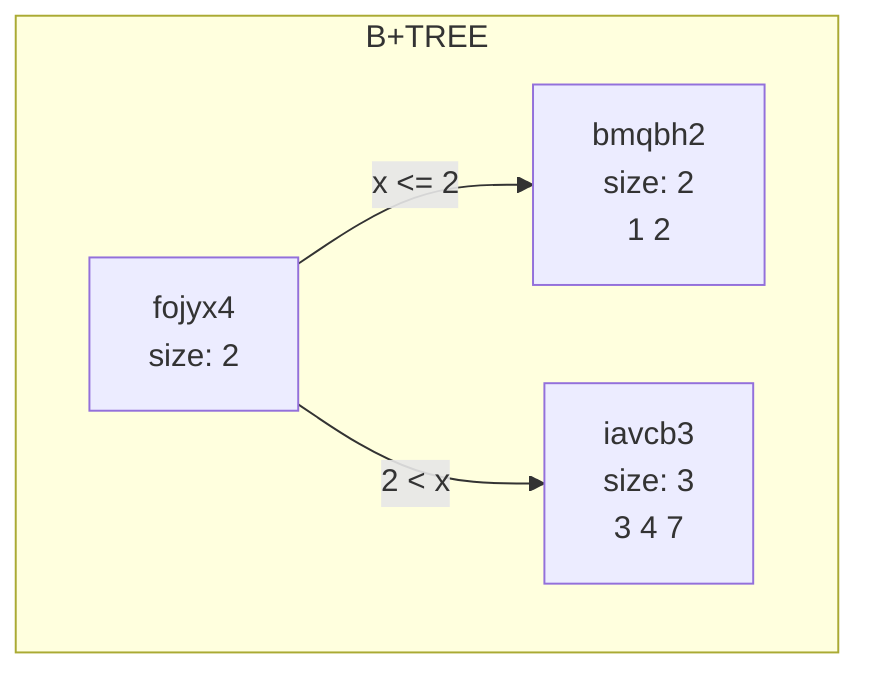
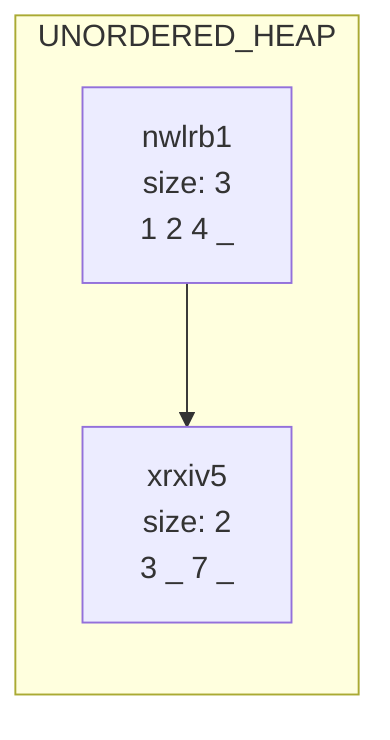

```mermaid
graph TD
subgraph B+TREE
fojyx4[fojyx4<br/>size: 2<br/>]
bmqbh2[bmqbh2<br/>size: 2<br/>1 2 ]
fojyx4-->|x <= 2|bmqbh2
iavcb3[iavcb3<br/>size: 3<br/>3 4 7 ]
fojyx4-->|2 < x|iavcb3
end
```

```mermaid
graph LR
subgraph UNORDERED_HEAP
nwlrb1[nwlrb1<br/>size: 3<br/>1 2 4 _ ]
xrxiv5[xrxiv5<br/>size: 2<br/>3 _ 7 _ ]
nwlrb1-->xrxiv5
end
```
